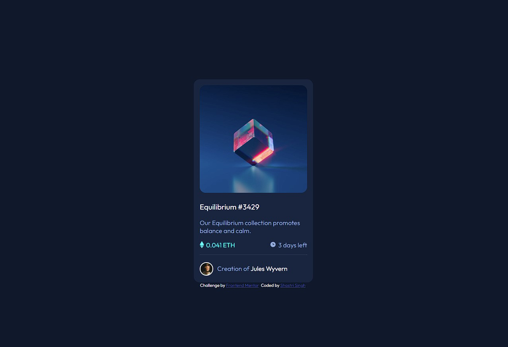

# Frontend Mentor - NFT preview card component solution

This is a solution to the [NFT preview card component challenge on Frontend Mentor](https://www.frontendmentor.io/challenges/nft-preview-card-component-SbdUL_w0U). Frontend Mentor challenges help you improve your coding skills by building realistic projects. 

## Table of contents

- [Overview](#overview)
  - [Screenshot](#screenshot)
  - [Links](#links)
- [My process](#my-process)
  - [Built with](#built-with)
  - [What I learned](#what-i-learned)
  - [Continued development](#continued-development)
  - [Useful resources](#useful-resources)
- [Author](#author)
- [Acknowledgments](#acknowledgments)


## Overview

### Screenshot



### Links

- Solution URL: [nft-preview-card-component](https://github.com/shastri-singh/nft-preview-card-component)
- Live Site URL: [nft-preview-card-component URL](https://nft-preview-card-component-6iz.pages.dev/)

## My process

### Built with

- HTML5
- CSS3
- [Google Font](https://fonts.googleapis.com/css2?family=Outfit:wght@300;400;600;700&display=swap) - For font styles

### What I learned

- CSS colours with opacity.
- Using CSS flex containers
- Using div container for mouse hover effect


Code snippets:

```css
/* 
    Mouse Hover Icon View Container
*/
.view-image-container {
    margin-top: 215px;
    margin-left: 15px;
    margin-right: 15px;
    position: absolute;
    top: 0px;
    width: 270px;
    height: 270px;
    border-radius: 15px;
    display: flex;
    justify-content: center;
    align-items: center;
}
```
```css
/* 
    Mouse Hover Effect With Colour And Opacity
*/
.view-image-container:hover {
    position: absolute;
    background-image: url(/images/icon-view.svg);
    /* 
        Must use background-repeat: no-repeat to stop it 
        from filling the cointainer with images.
    */
    background-repeat: no-repeat;
    background-position: center;
    /* 
        Set the opacity after the colour so, it will not
        blockout the view-icon image.
    */
    background-color: hsl(178, 100%, 50%,0.3); 
    top: 0px;
    width: 270px;
    height: 270px;
    border-radius: 15px;
    display: flex;
    justify-content: center;
    align-items: center;
    margin-top: 215px;
    margin-left: 15px;
    margin-right: 15px;
}
```

```css
/* 
    Days Left Section
*/
.days-left-container {
    float: right;
}

.clock-icon {
    float: left;
    margin-right: 5px;
}
```

### Continued development

Currently Learning:
- HTML5
- CSS3 - 

Languages To Learn:
- Javascript
- Typescript
- SQL
- iQuery
- Next.js

Frameworks To Learn:
- Bootstrap
- Tailwind CSS
- Laravel

Library To Learn:
- React

### Useful resources

- [CSS Colors](https://www.w3schools.com/css/css3_colors.asp) - This was very helpful for learning about colours with opacity.
- [CSS Flex Container](https://www.w3schools.com/css/css3_flexbox_container.asp) - My understanding of flex containers improved after reading this.
- [CSS Opacity / Transparency](https://www.w3schools.com/css/css_image_transparency.asp) - These examples help me understand how CSS opacity can be used.
- [CSS align-items Property](https://www.w3schools.com/cssref/css3_pr_align-items.php) - This helped me understand how align items can be used with display flex.

## Author

- Website - [Shastri Singh](https://www.shastrisingh.com)
- Frontend Mentor - [@Aizen-senpai](https://www.frontendmentor.io/profile/Aizen-senpai)

## Acknowledgments

I would like to thank all software development teams who took the time to share their knowledge and tips on web development online.

